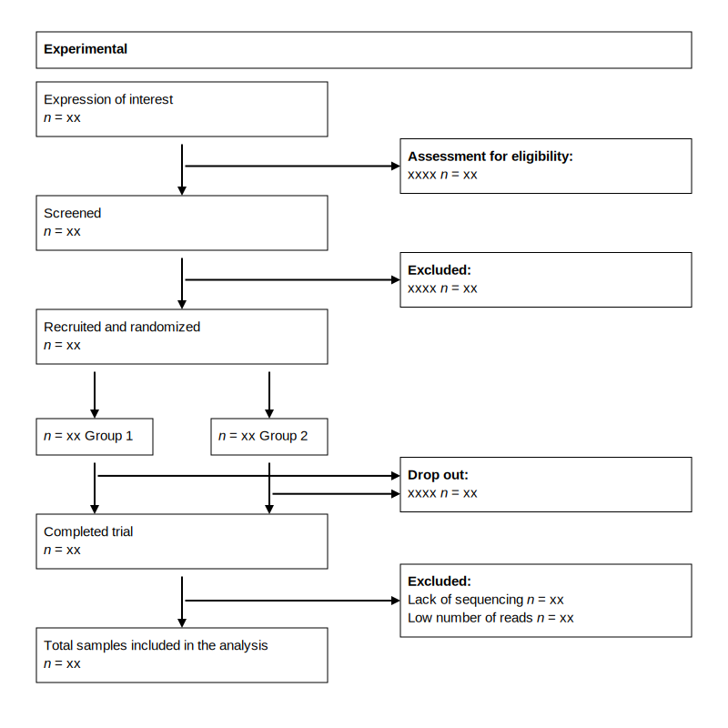

 

    

        <h3>
            <b>STORMS.jl</b>
        </h3>
    

STORMS.jl is a Julia package and web application built using the [Dash framework](https://dash.plotly.com/julia). Based on the <i><b>S</b>trengthening <b>T</b>he <b>O</b>rganization and <b>R</b>eporting of <b>M</b>icrobiome <b>S</b>tudies</i> (STORMS) checklist and analytical sample size flowcharts ([Mirzayi et al., 2021](https://doi.org/10.5281/zenodo.5714305)).

    

        
        
    

## References :book:
Mirzayi, C., Waldron, L., & Marques, F. (2021). Reporting guidelines for human microbiome research: The STORMS checklist and analytical sample size flowchart. Nature Medicine, 1–8. [https://doi.org/10.5281/zenodo.5714305](https://doi.org/10.5281/zenodo.5714305)

Moher, D., Altman, D., Schulz, K., Simera, I., & Wager, E. (2014). Guidelines for Reporting Health Research: A User’s Manual. John Wiley & Sons. [https://www.doi.org/10.1002/9781118715598](https://www.doi.org/10.1002/9781118715598)

## License :balance_scale:
Copyright © 2023. Ceco E Maples

This work is licensed under the [MIT License](https://opensource.org/license/mit/) - see the [`LICENSE`](LICENSE.md) file for details.
